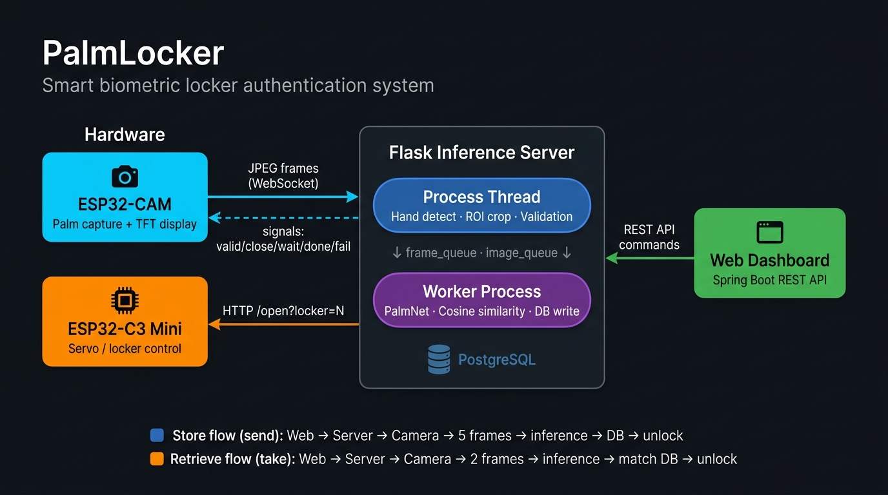
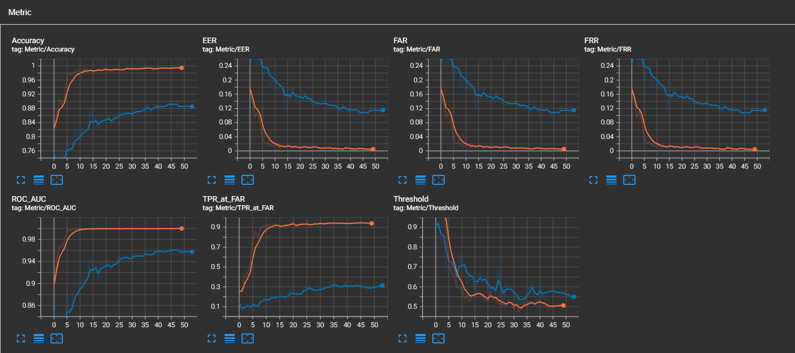
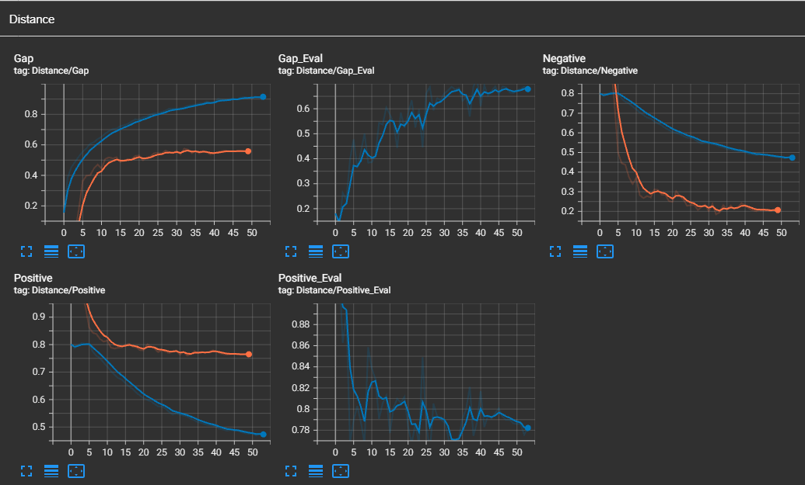
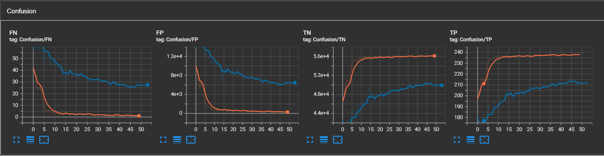
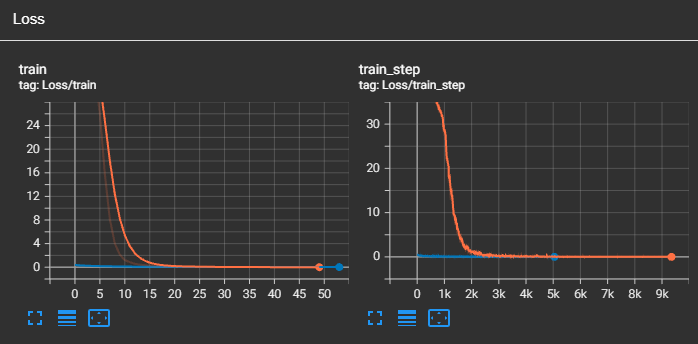

<div align="center">

# 🖐️ PalmLocker

**AI-powered biometric locker authentication using palmprint recognition**

[](https://python.org)
[](https://pytorch.org)
[](https://flask.palletsprojects.com)
[](https://spring.io/projects/spring-boot)
[](https://www.espressif.com)
[](https://postgresql.org)

</div>

---

## 1. Project Overview

PalmLocker is a complete smart locker authentication system based on **contactless palmprint biometrics**. The system combines deep learning-based identity verification with real-time embedded hardware control to provide a secure, touchless locker management solution.

A user simply places their palm in front of a camera. The system detects, validates, and extracts the palm region of interest (ROI), runs inference through a custom-trained neural network, compares the resulting 128-dimensional embedding against stored records via cosine similarity, and either unlocks the locker or rejects the attempt — all within seconds.

### Demo

<video src="docs/videos/demo.mp4" controls width="100%"></video>

---

## 2. System Architecture



### Data flow — Store palm (`send` mode)

```
[Web UI] → GET /event?command=send → [Flask] → WS "send" → [ESP32-CAM]
[ESP32-CAM] → JPEG stream → [Flask Process thread]
→ detect hand → validate open/size → crop ROI (224×224)
→ collect 5 frames → [Worker Process]
→ PalmNet inference → mean embedding → save to DB → HTTP /open → [ESP32-C3]
→ servo unlocks locker
```

### Data flow — Retrieve locker (`take` mode)

```
[Web UI] → GET /event?command=take → [Flask] → WS "take" → [ESP32-CAM]
[ESP32-CAM] → JPEG stream → [Flask Process thread]
→ detect hand → validate → crop ROI → collect 2 frames → [Worker Process]
→ PalmNet inference → mean embedding → cosine similarity vs DB
→ best match ≥ 0.65 → HTTP /open → [ESP32-C3] → servo unlocks locker
```

---

## 3. Features

| Feature | Description |
|---|---|
| 🖐️ **Contactless Authentication** | Palm is never touched — fully hygienic |
| 🧠 **Deep Learning Embeddings** | Custom PalmNet (ResNet + SE attention) → 128-dim L2-normalized vectors |
| 📐 **Geometric ROI Extraction** | Perspective-corrected 224×224 palm crop using MediaPipe hand landmarks |
| 📊 **Open-set Verification** | Cosine similarity with configurable threshold — no retraining needed for new users |
| ⚡ **Real-time Pipeline** | Multi-process architecture (Flask + Worker) with queue-based communication |
| 🔒 **Auto-lock** | Timeout-based automatic re-locking with configurable duration |
| 💡 **Visual Feedback** | TFT display on ESP32-CAM shows live palm guidance animations |
| 🌐 **Web Dashboard** | Spring Boot REST API + WebSocket for locker management |
| 📈 **Training Framework** | Full pipeline: ArcFace / Triplet loss, TensorBoard, EER/FAR/FRR metrics |

---

## 4. Tech Stack

### AI & Machine Learning

| Component | Technology |
|---|---|
| Framework | PyTorch 2.11 |
| Model backbone | Custom ResNet + SE blocks |
| Loss functions | ArcFace (primary), Triplet Margin |
| Hand detection | MediaPipe Hands |
| Image preprocessing | OpenCV, CLAHE, custom sharpen |
| Metrics | EER, FAR, FRR, ROC-AUC, Cosine similarity |
| Logging | TensorBoard |

### Inference Server

| Component | Technology |
|---|---|
| Framework | Flask + Flask-Sock |
| Real-time comm | WebSocket (binary JPEG streaming) |
| Concurrency | Python `threading` + `multiprocessing` |
| IPC | `multiprocessing.Queue` (frame_q, image_q, ws_q) |
| Database | PostgreSQL via psycopg2 |

### Web Application

| Component | Technology |
|---|---|
| Framework | Spring Boot 4.0 |
| Language | Java 21 |
| ORM | Spring Data JPA |
| Database | PostgreSQL |
| Real-time | Spring WebSocket |
| Build | Maven |

### Hardware / Firmware

| Component | Technology |
|---|---|
| Camera module | ESP32-CAM (Arduino / C++) |
| Controller | ESP32-C3 Mini (Arduino / C++) |
| Display | TFT (ST7789) |
| Actuator | Servo motor |
| Protocol | WebSocket (camera ↔ server), HTTP (server → controller) |
| Connectivity | Wi-Fi |

---

## 5. Project Structure

```
PalmLocker/
│
├── server/                         # Flask inference server
│   ├── app/                        #   HTTP routes + WebSocket handler
│   │   ├── main.py                 #     Entry point, process orchestration
│   │   ├── process.py              #     Frame preprocessing thread
│   │   ├── detect.py               #     MediaPipe hand detection
│   │   ├── valid.py                #     Palm open / size validation + ROI crop
│   │   ├── ws.py                   #     Thread-safe WebSocket manager
│   │   ├── queues.py               #     Multi-process queue manager
│   │   └── state.py                #     Shared application state
│   ├── worker/                     #   Inference worker (separate process)
│   │   ├── worker.py               #     Main worker loop
│   │   ├── model.py                #     Model loading + embedding extraction
│   │   ├── functional.py           #     Cosine similarity matching + DB save
│   │   └── locker.py               #     HTTP trigger to ESP32-C3
│   └── common/                     #   Shared config & database access
│       ├── config.py               #     All constants & paths
│       └── dao.py                  #     PostgreSQL data access object
│
├── hardware/                       # Embedded firmware (C / Arduino)
│   ├── esp32_cam/                  #   ESP32-CAM: palm image capture + TFT display
│   │   ├── palmcam.ino             #     Main sketch
│   │   ├── camera_module.*         #     Camera init & capture
│   │   ├── websocket_module.*      #     WS client: stream JPEG, recv commands
│   │   ├── tft_display.*           #     ST7789 display driver
│   │   ├── animations.*            #     Guidance animations (open/close/wait...)
│   │   ├── tasks.*                 #     FreeRTOS task definitions
│   │   └── config.*                #     Wi-Fi credentials, server IP
│   └── esp32_c3mini/               #   ESP32-C3 Mini: locker servo control
│       ├── esp32_c3mini.ino        #     Main sketch
│       ├── websocket.*             #     WS client: receive open/close commands
│       ├── button.*                #     Physical button handler
│       ├── htcl.*                  #     HTTP client for receiving signals
│       └── wf.*                    #     Wi-Fi connection helper
│
├── web/                            # Spring Boot web dashboard
│   └── src/main/java/              #   REST API + WebSocket
│
├── training/                       # AI model training pipeline
│   ├── src/
│   │   ├── model/                  #   PalmNet, ResBlock, SEBlock, ArcFaceLoss
│   │   ├── datasets/               #   ArcFace, Triplet, Eval dataset loaders
│   │   ├── training/               #   train.py, compare.py, metrics.py, sweep_threshold.py
│   │   └── transforms/             #   CLAHE, Sharpen, train/eval pipelines
│   ├── scripts/                    #   Data preprocessing utilities
│   │   ├── extract_roi.py          #     Batch ROI extraction from raw dataset
│   │   ├── splits.py               #     Train/val/test split generator
│   │   └── export_figure.py        #     Export evaluation figures
│   ├── data/                       #   Raw / processed / split datasets (gitignored)
│   ├── runs/                       #   TensorBoard logs (gitignored)
│   └── results/                    #   Evaluation JSON + figures (gitignored)
│
├── models/                         # Pretrained model weights (.pth)
├── storage/                        # Runtime palm images saved by server
├── docs/                           # Documentation assets
│   ├── images/                     #   Metric plots, confusion matrix, etc.
│   └── videos/                     #   demo.mp4 (place here for GitHub embed)
│
├── requirements.txt
└── README.md
```

---

## 6. AI / Model Training

### Dataset

Two publicly available palmprint datasets are used:

| Dataset | Usage | Notes |
|---|---|---|
| [Tongji Palmprint Database](http://sse.tongji.edu.cn/linzhang/CR/Palmprint/Palmprint.htm) | Training | ~600 subjects, 2 sessions, 10 images/session |
| [IITD Palmprint Database](https://www4.comp.polyu.edu.hk/~csajaykr/IITD/Database_Palm.htm) | Validation & Testing | 230 subjects, 2 sessions |

### Preprocessing

Raw dataset images are processed with a geometry-aware ROI extraction pipeline:

1. **Hand detection** — MediaPipe Hands detects 21 landmarks
2. **Perspective correction** — 4 keypoints (L5, L17 + perpendicular direction) define a square crop aligned to the palm axis, independent of hand rotation
3. **CLAHE** — Contrast Limited Adaptive Histogram Equalization enhances texture visibility
4. **Resize** — All images resized to 224×224

```bash
# Extract ROI from raw dataset images
python training/scripts/extract_roi.py

# Split dataset into train/val/test
python training/scripts/splits.py
```

#### Transform Pipeline

| Stage | Train | Eval |
|---|---|---|
| Resize | 224×224 | 224×224 |
| Augmentation | RandomAffine (±8°, translate 2%, scale ±2%) | — |
| Color | ColorJitter (brightness/contrast ±15%) | — |
| Sharpen | SharpenTransform (p=0.5) | — |
| Grayscale | ✓ | ✓ |
| CLAHE | ✓ | ✓ |
| Normalize | mean=0.5, std=0.5 | mean=0.5, std=0.5 |

### Model Architecture

**PalmNet** — a custom ResNet-inspired backbone with Squeeze-and-Excitation (SE) channel attention.

```
Input: (B, 1, 224, 224)  — grayscale palmprint

Stem:   Conv7×7(1→64, stride=2) → BN → ReLU → MaxPool3×3(stride=2)   [→ 56×56]
Layer1: ResBlock(64→64)  × 2                                           [→ 56×56]
Layer2: ResBlock(64→128, stride=2) + ResBlock(128→128)                 [→ 28×28]
Layer3: ResBlock(128→256, stride=2) + ResBlock(256→256)                [→ 14×14]
Layer4: ResBlock(256→512, stride=2) + ResBlock(512→512)                [→  7×7 ]
Head:   AdaptiveAvgPool → Flatten → Dropout(0.2) → Linear(512→128)

Output: (B, 128)  — L2-normalized embedding vector
```

Each **ResBlock** contains:
- Conv3×3 → BN → ReLU → Conv3×3 → BN
- **SE Block** (squeeze via GlobalAvgPool, excitation via FC bottleneck with sigmoid)
- Residual shortcut (Conv1×1 projection when channels/stride change)

### Training

Two loss functions are supported:

#### ArcFace (recommended)

Adds an additive angular margin `m` to the target class angle before softmax, enforcing tighter intra-class clusters on the hypersphere.

```
cos(θ + m)  with  s=64.0, m=0.5 (~28.6°)
```

```bash
python training/src/training/train.py \
    --loss arcface \
    --train_path training/data/splits/train \
    --val_path training/data/splits/val \
    --model_name palmnet_arcface \
    --epochs 50 \
    --batch_size 64 \
    --lr 1e-4 \
    --scale 64.0 \
    --margin 0.5
```

#### Triplet Loss

```bash
python training/src/training/train.py \
    --loss triplet \
    --train_path training/data/splits/train \
    --val_path training/data/splits/val \
    --model_name palmnet_triplet \
    --epochs 50 \
    --batch_size 64 \
    --lr 1e-4 \
    --margin 0.3
```

Both use:
- **Optimizer**: Adam with Cosine Annealing LR (`eta_min=1e-6`)
- **Mixed precision**: `torch.amp.autocast` + `GradScaler`
- **TensorBoard**: loss, EER, FAR, FRR, ROC-AUC, similarity gap logged per epoch

```bash
# Monitor training
tensorboard --logdir training/runs
```

### Evaluation

The system is evaluated using open-set biometric verification metrics:

| Metric | Description |
|---|---|
| **EER** | Equal Error Rate — threshold where FAR = FRR (lower is better) |
| **FAR** | False Acceptance Rate — impostor accepted as genuine |
| **FRR** | False Rejection Rate — genuine user rejected |
| **ROC-AUC** | Area under the ROC curve (higher is better) |
| **TPR @ FAR=0.1%** | True Positive Rate at a strict operating point |

#### Evaluation protocol

1. Gallery embeddings: mean of session 1 images per subject
2. Probe embeddings: session 2 images
3. All probe vs all gallery cosine similarities → FAR/FRR curve → EER

**Results:**

| Model | Accuracy | EER | FAR | FRR | ROC-AUC |
|---|---|---|---|---|---|
| Triplet Loss | 87.87% | 12.05% | 12.12% | 11.98% | 0.9555 |
| **ArcFace** | **97.78%** | **2.13%** | **2.21%** | **2.06%** | **0.9971** |

#### Evaluation charts

<table>
  <tr>
    <td align="center"><br><sub>FAR / FRR curve — EER intersection point</sub></td>
    <td align="center"><br><sub>Positive vs Negative similarity distribution</sub></td>
  </tr>
  <tr>
    <td align="center"><br><sub>Confusion matrix at EER threshold</sub></td>
    <td align="center"><br><sub>Training loss curve</sub></td>
  </tr>
</table>

### Model Export / Deployment

The best checkpoint is saved as a `.pth` state dict and placed in `models/`.

```bash
# Compare two trained models side by side
python training/src/training/compare.py \
    --model1 models/palmnet_v1.pth \
    --model2 models/palmnet_arcface_best.pth \
    --val_path training/data/splits/val
```

The deployed model is loaded by the inference worker at server startup and kept in memory for the entire session lifetime.

---

## 7. Server / Backend

### Architecture

The Flask server uses a **3-process / 3-thread** architecture to keep real-time JPEG streaming decoupled from heavy ML inference:

```
Main Process
├── Flask HTTP server          — handles GET /event (Web UI commands)
├── WebSocket handler          — receives JPEG frames from ESP32-CAM
├── Thread: preprocess()       — frame_queue → hand detect → ROI crop → image_queue
└── Thread: ws_sender()        — ws_queue → send result back to ESP32-CAM

Worker Process (separate OS process)
└── worker()                   — image_queue → PalmNet → DB → HTTP /open
```

**Queue design:**

| Queue | Direction | Content |
|---|---|---|
| `frame_queue` (cap=50) | WebSocket → preprocess thread | Raw JPEG bytes |
| `image_queue` (cap=15) | preprocess thread → worker process | Cropped ROI batch + metadata |
| `ws_queue` (cap=15) | worker process → ws_sender thread | String signals (`done`, `fail`, locker_id) |

All queues use a **drop-old** strategy on full (non-blocking put → evict oldest → insert new), preventing pipeline stalls.

### API

| Method | Endpoint | Description |
|---|---|---|
| `GET` | `/event?command=send` | Start a "store palm" session (user deposits item) |
| `GET` | `/event?command=take` | Start a "verify palm" session (user retrieves item) |
| `WS` | `/ws` | ESP32-CAM persistent WebSocket connection |

**WebSocket signals sent to ESP32-CAM:**

| Signal | Meaning |
|---|---|
| `send` / `take` | Start capture mode |
| `valid` | Current frame is a valid open palm |
| `close` | Palm is not fully open |
| `small` | Palm is too far from camera |
| `wait` | Processing inference, please hold still |
| `done` | Authentication successful |
| `fail` | Authentication failed or timeout |
| `full` | No available lockers |
| `<int>` | Locker number assigned (on successful store) |

### Database

PostgreSQL with two tables:

```sql
-- Locker table
CREATE TABLE locker (
    id       SERIAL PRIMARY KEY,
    location VARCHAR,
    status   VARCHAR  -- 'available' | 'occupied'
);

-- Session table
CREATE TABLE session (
    id         VARCHAR PRIMARY KEY,
    locker_id  INTEGER REFERENCES locker(id),
    palm_hash  TEXT,        -- JSON array of float32 embedding (128-dim)
    start_time TIMESTAMP,
    end_time   TIMESTAMP,
    status     VARCHAR      -- 'active' | 'inactive'
);
```

### Model Inference

The Worker Process runs inference independently to avoid blocking the Flask event loop:

1. Load `PalmNet` from `.pth` at startup → GPU/CPU warmup with a dummy tensor
2. For each batch of ROI images: `BGR → RGB → PIL → eval_transform → stack → model(batch)`
3. Compute **mean embedding** across the batch (more robust than single-frame)
4. **Store mode**: save embedding as JSON in `session.palm_hash`
5. **Verify mode**: load all active session embeddings → vectorized cosine dot product → pick best match → accept if score ≥ `THRESHOLD` (default: 0.65)

---

## 8. Hardware / Firmware

### Hardware Components

| Component | Model | Role |
|---|---|---|
| Camera module | ESP32-CAM (AI-Thinker) | Capture palm images, stream to server, display feedback |
| Controller | ESP32-C3 Mini | Receive auth result, drive servo to unlock |
| Display | TFT ST7789 (240×240) | Show guidance animations to user |
| Actuator | SG90 Servo motor | Physical locker latch mechanism |
| Power | 5V USB / LiPo | Power supply for both boards |

### Wiring / Circuit

```
ESP32-CAM
├── Camera (OV2640) — onboard
├── TFT Display — SPI (GPIO 12/13/14/15/2)
└── Wi-Fi — onboard 2.4GHz

ESP32-C3 Mini
├── Servo signal — GPIO 5
└── Wi-Fi — onboard 2.4GHz
```

### Firmware

#### ESP32-CAM (`hardware/esp32_cam/`)

| File | Responsibility |
|---|---|
| `palmcam.ino` | Setup & main loop, FreeRTOS task spawning |
| `camera_module.*` | OV2640 init, JPEG frame capture |
| `websocket_module.*` | WS client: send JPEG binary frames, receive text commands |
| `tft_display.*` | ST7789 driver, draw frames / text |
| `animations.*` | Pre-encoded palm guidance animations (open palm, hold still, success, fail) |
| `tasks.*` | FreeRTOS tasks for concurrent capture & display |
| `config.*` | `SSID`, `PASSWORD`, `SERVER_IP`, `SERVER_PORT` |

#### ESP32-C3 Mini (`hardware/esp32_c3mini/`)

| File | Responsibility |
|---|---|
| `esp32_c3mini.ino` | Setup & main loop |
| `websocket.*` | WS client to receive open commands from server |
| `htcl.*` | HTTP client — listens for `/open?locker=N` from Flask |
| `button.*` | Physical override button for manual unlock |
| `wf.*` | Wi-Fi connection + reconnection logic |

### Communication Protocol

```
ESP32-CAM  ──── WebSocket (ws://SERVER_IP:5000/ws) ────►  Flask Server
           ◄──── text signals (valid/close/wait/done/fail)  ────

Flask Server  ──── HTTP GET /open?locker=N ────►  ESP32-C3 Mini
```

- **Camera → Server**: Binary WebSocket frames (raw JPEG bytes, ~30KB each)
- **Server → Camera**: UTF-8 text command strings
- **Server → Controller**: Plain HTTP GET request with locker number as query param

---

## 9. Web Application

### Tech Stack

The web dashboard is built with **Spring Boot 4.0** (Java 21), using:

- `spring-boot-starter-webmvc` — REST API
- `spring-boot-starter-data-jpa` + PostgreSQL driver — Database ORM
- `spring-boot-starter-websocket` — Real-time updates
- Maven build system

### Features

- View all lockers and their current status (available / occupied)
- Trigger **Store** (`send`) and **Retrieve** (`take`) sessions via REST API
- Real-time locker status updates via WebSocket
- Session history and audit log

### Screenshots

> *(Add screenshots to `docs/images/` and embed them here)*

---

## 10. Installation & Setup

### Prerequisites

- Python 3.10+
- CUDA-capable GPU (optional, CPU inference works)
- PostgreSQL 15+
- Java 21 + Maven
- Arduino IDE with ESP32 board support

### AI Environment

```bash
# Clone repository
git clone https://github.com/tienson05/palm-locker.git
cd palm-locker

# Create virtual environment
python -m venv .venv
.venv\Scripts\activate          # Windows
# source .venv/bin/activate     # Linux/macOS

# Install dependencies
pip install -r requirements.txt

# Additional training dependencies (only needed for training)
pip install tensorboard scikit-learn prettytable
```

### Server Setup

**1. Configure `server/common/config.py`:**

```python
MODEL_NAME  = "path/to/models/palmnet_arcface_best.pth"
ESP32_IDR   = "http://<ESP32_C3_IP>/open"
STORAGE_PATH = "path/to/storage"

PORT = 5000
HOST = "0.0.0.0"

THRESHOLD = 0.65      # cosine similarity threshold
SEND_IMAGES = 5       # frames collected per store session
TAKE_IMAGES = 2       # frames collected per verify session
TIMEOUT = 15          # seconds before session timeout

DATABASE_NAME = "palm_lockers"
USER          = "postgres"
PASSWORD      = "your_password"
DATABASE_PORT = "5432"
```

**2. Create PostgreSQL database:**

```sql
CREATE DATABASE palm_lockers;

CREATE TABLE locker (
    id       SERIAL PRIMARY KEY,
    location VARCHAR,
    status   VARCHAR DEFAULT 'available'
);

CREATE TABLE session (
    id         VARCHAR PRIMARY KEY,
    locker_id  INTEGER REFERENCES locker(id),
    palm_hash  TEXT,
    start_time TIMESTAMP,
    end_time   TIMESTAMP,
    status     VARCHAR DEFAULT 'active'
);

-- Seed some lockers
INSERT INTO locker (location, status) VALUES
    ('Row A - 01', 'available'),
    ('Row A - 02', 'available'),
    ('Row A - 03', 'available');
```

**3. Run the server:**

```bash
python server/app/main.py
```

### Hardware Setup

**ESP32-CAM:**

1. Open `hardware/esp32_cam/palmcam.ino` in Arduino IDE
2. Edit `config.h`:
   ```cpp
   #define WIFI_SSID     "YourSSID"
   #define WIFI_PASSWORD "YourPassword"
   #define SERVER_IP     "192.168.x.x"   // Flask server IP
   #define SERVER_PORT   5000
   ```
3. Select board: `AI Thinker ESP32-CAM` → Flash

**ESP32-C3 Mini:**

1. Open `hardware/esp32_c3mini/esp32_c3mini.ino` in Arduino IDE
2. Edit Wi-Fi credentials and server IP in `wf.h`
3. Select board: `ESP32C3 Dev Module` → Flash

### Web Setup

```bash
cd web

# Configure database in src/main/resources/application.properties
# spring.datasource.url=jdbc:postgresql://localhost:5432/palm_lockers
# spring.datasource.username=postgres
# spring.datasource.password=your_password

mvn spring-boot:run
```

---

## 11. Usage

### How to Run the Complete System

Start all components in this order:

**Step 1 — Start the Flask inference server**
```bash
python server/app/main.py
```
Wait for: `* Running on http://0.0.0.0:5000`

**Step 2 — Power on hardware**
- Power on **ESP32-C3 Mini** — it will connect to Wi-Fi and listen for HTTP commands
- Power on **ESP32-CAM** — it will connect to Wi-Fi and establish WebSocket with the Flask server

Wait for the TFT display to show the idle animation (palm icon).

**Step 3 — Start the web dashboard**
```bash
cd web && mvn spring-boot:run
```

**Step 4 — Store an item**
```
Web UI → click "Store" button
          → GET /event?command=send
          → ESP32-CAM starts capturing
          → User presents open palm to camera
          → TFT guides user (open/close/small/valid feedback)
          → 5 valid frames collected → inference → embedding saved to DB
          → Locker N unlocks automatically → user places item → locker closes
          → Web UI shows locker N as occupied
```

**Step 5 — Retrieve an item**
```
Web UI → click "Retrieve" button
          → GET /event?command=take
          → ESP32-CAM starts capturing
          → User presents open palm
          → 2 valid frames collected → inference → cosine similarity match
          → score ≥ 0.65 → matched locker unlocks
          → Session marked inactive → locker available again
```

### Training Your Own Model

```bash
# 1. Prepare dataset (run from project root)
python training/scripts/extract_roi.py
python training/scripts/splits.py

# 2. Train with ArcFace
python training/src/training/train.py \
    --loss arcface \
    --train_path training/data/splits/train \
    --val_path training/data/splits/val \
    --model_name my_palmnet \
    --epochs 50 --batch_size 64 --lr 1e-4

# 3. Monitor training
tensorboard --logdir training/runs

# 4. Compare checkpoints
python training/src/training/compare.py \
    --model1 models/checkpoint_v1.pth \
    --model2 models/checkpoint_v2.pth \
    --val_path training/data/splits/val

# 5. Update config.py with new model path, restart server
```